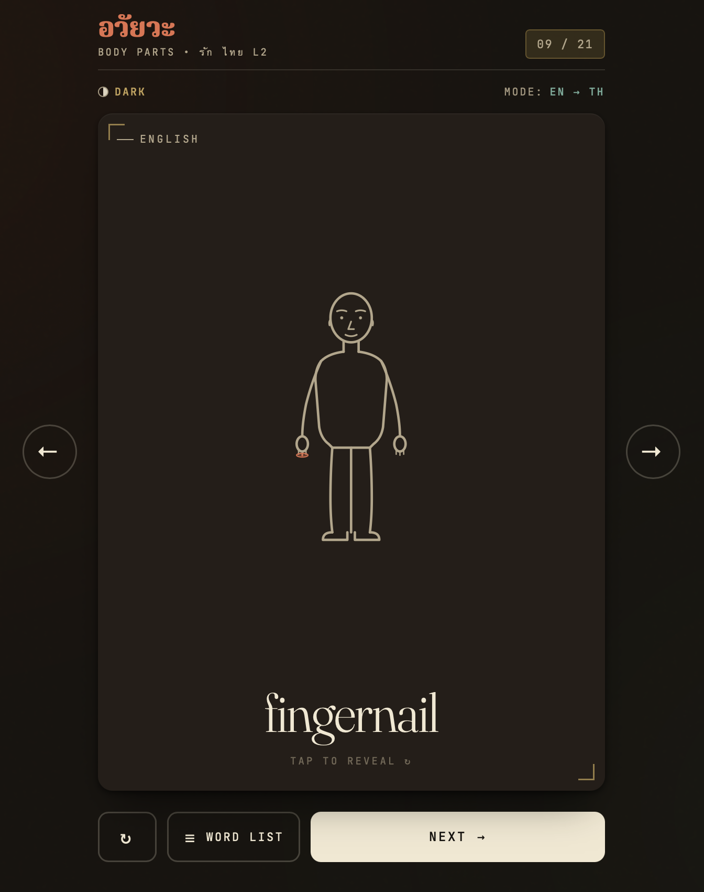
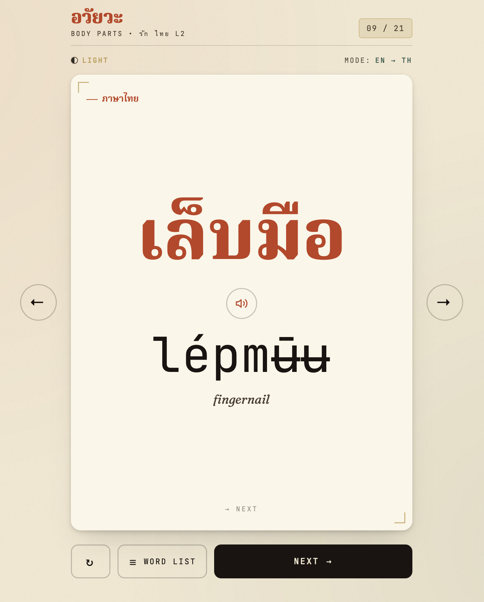

# อวัยวะ — Thai Body Parts Flashcards

**Live:** https://drummingdemon.github.io/thai-cards/

<p align="center">
  
  
</p>

A zero-dependency flashcard web app for learning Thai body-part vocabulary. No build step, no framework, no CDNs at runtime — scripts, styles, and fonts are all served from the repo itself.

Romanization uses tone-marked diacritics (`à` low, `â` falling, `á` high, `ǎ` rising; macron `ā` marks a long mid-tone vowel) so learners can read the pronunciation without prior IPA familiarity.

## Features

- **Two study directions.** Toggle between EN → TH (English prompt, Thai reveal) and TH → EN. In TH-first mode the romanization is shown alongside the Thai so you can build sound recognition before reading.
- **Anatomical highlight.** Each English prompt is paired with a dot or ring on a stick-figure SVG pointing to the body part in question.
- **Thai text-to-speech.** A speaker button on the back of each card plays the Thai pronunciation via the browser's `SpeechSynthesis` API. Words in the list view are also tap-to-speak. The control is hidden automatically on browsers without speech support.
- **Word list view.** A modal lists every word in the deck (alphabetised by English) with the Thai script and romanization side by side; the list is scrollable on small screens.
- **Smooth flip and slide transitions.** Cards flip on a 3D Y-axis; advancing slides the current card out and the next one in from the right.
- **Dark and light theme.** Warm-cream palette by day, deep-warm dark by night. Respects `prefers-color-scheme` on first load and persists the choice in `localStorage`.
- **Wide-screen side arrows.** On viewports ≥760px, prev/next arrows appear on either side of the card for one-tap navigation.
- **Keyboard support.** `Space`/`Enter` to flip, `→`/`n` to advance, `←`/`p` to go back, `Esc` to close the word list.
- **Mobile-friendly layout.** Safe-area insets are honoured so controls stay reachable on devices with rounded corners or dynamic browser chrome.

## Vocabulary

| #  | English      | ภาษาไทย   | Romanization |
|----|--------------|-----------|--------------|
| 01 | eye          | ตา        | tāa          |
| 02 | ear          | หู         | hǔu          |
| 03 | mouth        | ปาก       | pàak         |
| 04 | nose         | จมูก      | càmùuk       |
| 05 | foot         | เท้า       | tháaw        |
| 06 | arm          | แขน       | khɛ̌ɛn        |
| 07 | leg          | ขา        | khǎa         |
| 08 | head         | หัว       | hǔa          |
| 09 | eyebrow      | คิ้ว       | khíw         |
| 10 | eyelash      | ขนตา      | khǒntāa      |
| 11 | tooth        | ฟัน        | fān          |
| 12 | tongue       | ลิ้น        | lín          |
| 13 | face         | หน้า      | nâa          |
| 14 | neck         | คอ        | khɔ̄ɔ         |
| 15 | shoulder     | ไหล่      | lày          |
| 16 | hand         | มือ        | mʉ̄ʉ          |
| 17 | finger       | นิ้วมือ    | níwmʉ̄ʉ       |
| 18 | fingernail   | เล็บมือ    | lépmʉ̄ʉ       |
| 19 | stomach      | ท้อง       | thɔ́ɔŋ        |
| 20 | knee         | เข่า       | khàw         |
| 21 | elbow        | ศอก       | sɔ̀ɔk         |

## Running locally

Serve the folder with any static-file server, for example:

```sh
python3 -m http.server 8000
# then visit http://localhost:8000
```

Opening `index.html` directly via `file://` works in most browsers, but a static server is recommended — it avoids font-loading restrictions on some browsers and mirrors the deployed GitHub Pages environment.

## Text-to-speech

The speaker button uses the browser's built-in `SpeechSynthesis` API and the system's installed `th-TH` voice. Voice quality varies by platform:

- **macOS / iOS:** ships with Thai voices (e.g. *Kanya*, *Narisa*); install additional voices via *System Settings → Accessibility → Spoken Content → Manage Voices*.
- **Windows:** install the Thai language pack to enable a Thai SAPI voice.
- **Linux / Chrome OS:** support depends on the available speech engine; if no Thai voice is installed, the speaker control is hidden.

## Project structure

```
thai-cards/
├── index.html      # markup: header, card faces, SVG figure, controls, modal
├── styles.css      # all styles, including light/dark theme variables
├── fonts.css       # @font-face declarations pointing at fonts/
├── app.js          # word data, render logic, flip/slide transitions, speech
├── fonts/          # self-hosted .woff2 files plus OFL license texts
└── README.md
```

To extend the deck, add an entry to `WORDS` in `app.js`. If the new word maps to a body part, add a matching entry in `HIGHLIGHTS` to position its highlight on the figure.

## Fonts

All three typefaces are self-hosted from `fonts/` and ship under the **SIL Open Font License 1.1**. The full license text plus each font's upstream copyright notice lives alongside the `.woff2` files:

- **Fraunces** — Copyright 2018 The Fraunces Project Authors. See `fonts/Fraunces-OFL.txt`.
- **Noto Serif Thai** — Copyright 2022 The Noto Project Authors. See `fonts/NotoSerifThai-OFL.txt`.
- **JetBrains Mono** — Copyright 2020 The JetBrains Mono Project Authors. See `fonts/JetBrainsMono-OFL.txt`.
