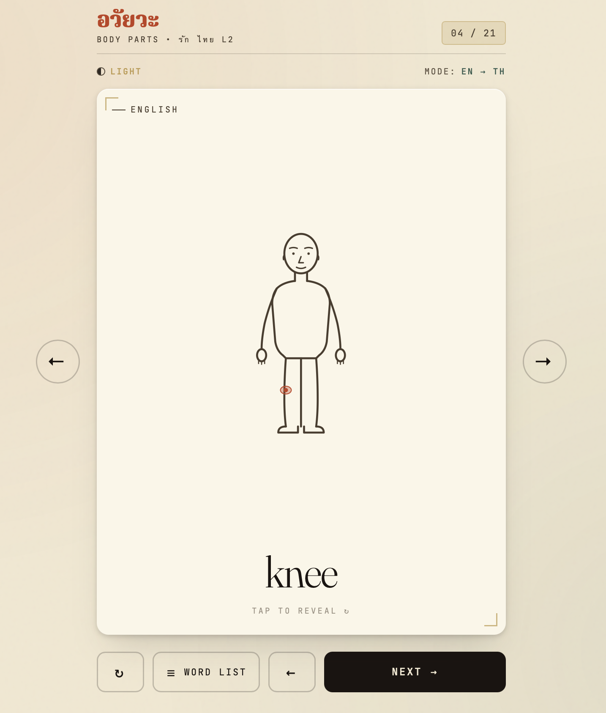
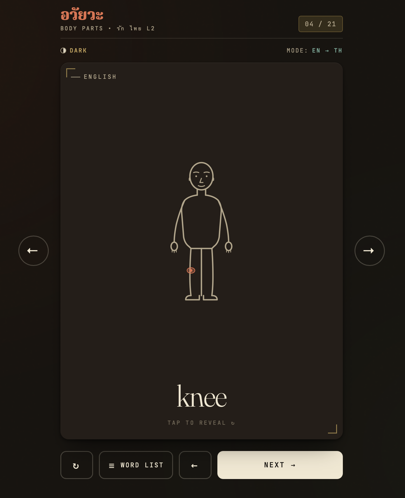
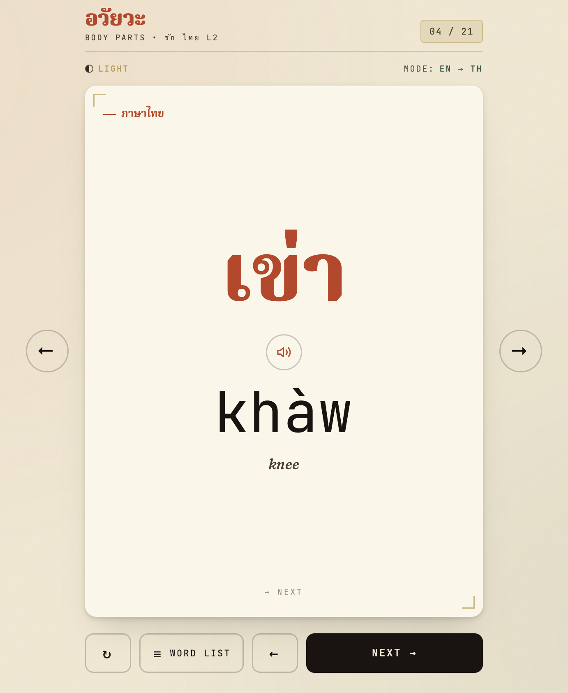
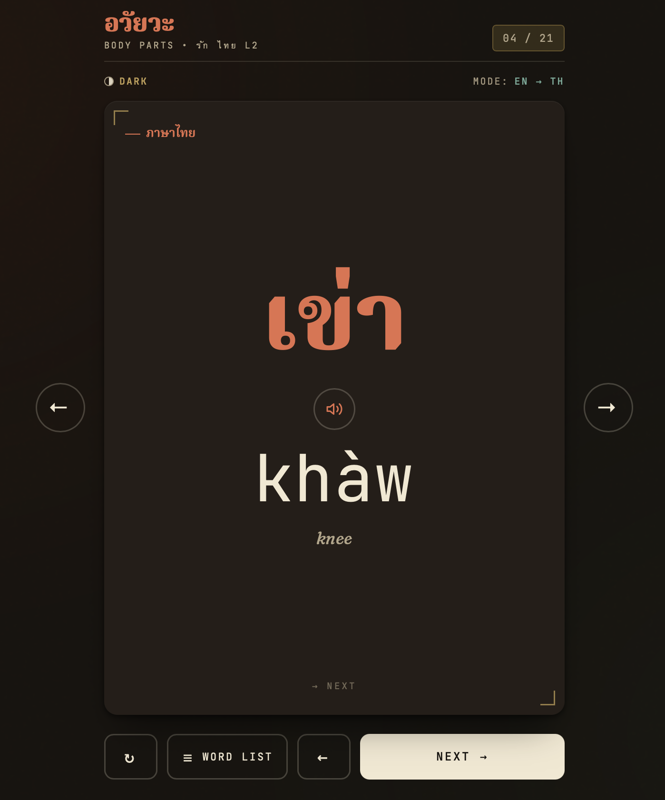
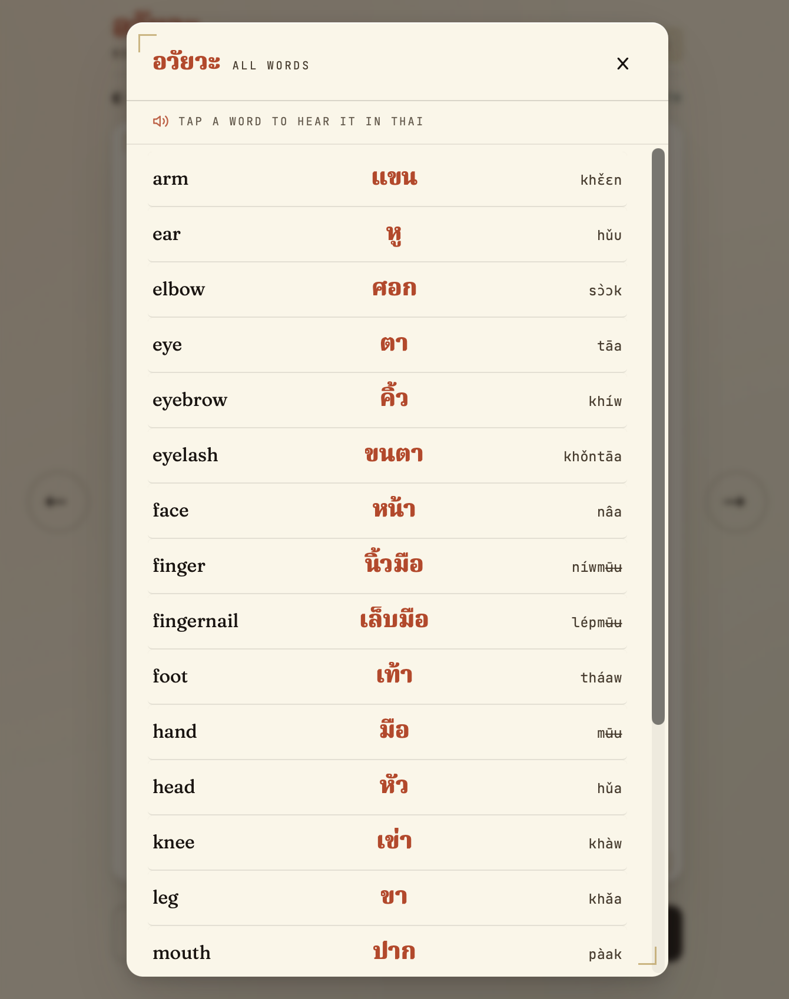
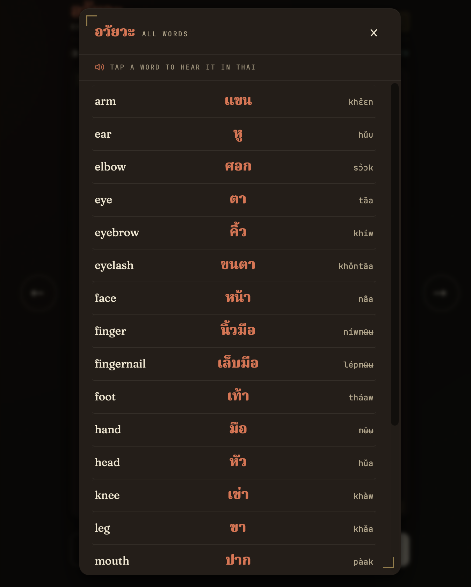

# บัตรคำ — Thai Flashcards

**Live:** https://drummingdemon.github.io/thai-cards/

A zero-dependency flashcard web app for Thai vocabulary. Multi-deck:
**Body Parts** (21 cards) and **Months** (12 cards, with zodiac etymology).
No build step, no framework, no CDNs at runtime — scripts, styles, and fonts
are all served from the repo itself.

<p align="center">
  
  
</p>
<p align="center">
  
  
</p>
<p align="center">
  
  
</p>

Romanization uses tone-marked diacritics (`à` low, `â` falling, `á` high, `ǎ` rising; macron `ā` marks a long mid-tone vowel) so learners can read the pronunciation without prior IPA familiarity.

## Decks

| Deck | Cards | Modes | Default |
|------|-------|-------|---------|
| **Body Parts** (อวัยวะ) | 21 | random | random |
| **Months** (เดือน) | 12 | sequential · random · numbers | sequential |

### Routing

URL hash drives view + mode — bookmarkable, shareable, survives refresh.

- `#` — home / deck selector
- `#body-parts` — body parts deck
- `#months` — months, sequential (January → December — test part 1: recite in order)
- `#months/random` — months, shuffled
- `#months/numbers` — number-prompt drill (test part 2: ครู says a number, student answers the month)

### Months — what makes them learnable as one system

Thai month names are Sanskrit zodiac signs with a length-encoding suffix. Capricorn through Sagittarius maps onto January → December; the zodiac root lives *inside* each name (มกร in มกรา**คม**, สิงห์ in สิงห**าคม**). The suffix gives the day-count:

- **-คม** (`-khom`) = 31 days
- **-ยน** (`-yon`) = 30 days
- **-พันธ์** (`-phan`) = February (alone)

Each card surfaces the zodiac creature + root etymology on the back so the connection lands explicitly, not as twelve isolated Sanskrit words to memorise. The All-Months modal opens with the same framing as a refresher — the explainer is collapsible (tap *Why these names?*) and the open/closed state persists in `localStorage` so returning learners get straight to the list.

## Features

- **Two study directions.** Toggle between EN → TH (English prompt, Thai reveal) and TH → EN. In TH-first mode the romanization is shown alongside the Thai so you can build sound recognition before reading.
- **Anatomical highlight.** Each English prompt is paired with a dot or ring on a stick-figure SVG pointing to the body part in question.
- **Thai text-to-speech.** A speaker button on the back of each card plays the Thai pronunciation via the browser's `SpeechSynthesis` API. Words in the list view are also tap-to-speak. The control is hidden automatically on browsers without speech support.
- **Word list view.** A modal lists every word in the deck (alphabetised by English) with the Thai script and romanization side by side; the list is scrollable on small screens.
- **Smooth flip and slide transitions.** Cards flip on a 3D Y-axis; advancing slides the current card out and the next one in from the right.
- **Dark and light theme.** Warm-cream palette by day, deep-warm dark by night. Respects `prefers-color-scheme` on first load and persists the choice in `localStorage`.
- **Wide-screen side arrows.** On viewports ≥760px, prev/next arrows appear on either side of the card for one-tap navigation.
- **Keyboard support.** `Space`/`Enter` to flip, `→`/`n` to advance, `←`/`p` to go back, `Esc` to close the word list.
- **Mobile-friendly layout.** Safe-area insets are honoured so controls stay reachable on devices with rounded corners or dynamic browser chrome.

## Vocabulary

### Months (เดือน)

| #  | English   | ภาษาไทย      | Romanization        | Days | Ending | Zodiac      | Root        |
|----|-----------|-------------|---------------------|------|--------|-------------|-------------|
| 01 | January   | มกราคม      | mákarāakhōm         | 31   | -khom  | Capricorn   | มกร / makara — sea-dragon |
| 02 | February  | กุมภาพันธ์   | kūmphāaphān         | 28   | -phan  | Aquarius    | กุมภ์ / kumbha — water pot |
| 03 | March     | มีนาคม      | mīināakhōm          | 31   | -khom  | Pisces      | มีน / mina — fish |
| 04 | April     | เมษายน      | mēesǎayōn           | 30   | -yon   | Aries       | เมษ / mesha — ram |
| 05 | May       | พฤษภาคม     | phrʉ́tsaphāakhōm     | 31   | -khom  | Taurus      | พฤษภ / vrishabha — bull |
| 06 | June      | มิถุนายน     | míthùnāayōn         | 30   | -yon   | Gemini      | มิถุน / mithuna — twins |
| 07 | July      | กรกฎาคม     | karákadāakhōm       | 31   | -khom  | Cancer      | กรกฎ / karkata — crab |
| 08 | August    | สิงหาคม      | sǐŋhǎakhōm          | 31   | -khom  | Leo         | สิงห์ / singha — lion |
| 09 | September | กันยายน      | kānyāayōn           | 30   | -yon   | Virgo       | กันย์ / kanya — maiden |
| 10 | October   | ตุลาคม       | tùlāakhōm           | 31   | -khom  | Libra       | ตุล / tula — scales |
| 11 | November  | พฤศจิกายน   | phrʉ́tsacìkāayōn     | 30   | -yon   | Scorpio     | พฤศจิก / vrishchika — scorpion |
| 12 | December  | ธันวาคม      | thānwāakhōm         | 31   | -khom  | Sagittarius | ธนู / dhanu — bow |

> Romanisations transcribed verbatim from the school book (Bangkok edition, Mahatun Plaza). Joined-syllable form with tone marks; `ŋ` denotes the velar nasal in สิงหาคม.

### Body parts (อวัยวะ)

| #  | English      | ภาษาไทย   | Romanization |
|----|--------------|-----------|--------------|
| 01 | eye          | ตา        | tāa          |
| 02 | ear          | หู         | hǔu          |
| 03 | mouth        | ปาก       | pàak         |
| 04 | nose         | จมูก      | càmùuk       |
| 05 | foot         | เท้า       | tháaw        |
| 06 | arm          | แขน       | khɛ̌ɛn        |
| 07 | leg          | ขา        | khǎa         |
| 08 | head         | หัว       | hǔa          |
| 09 | eyebrow      | คิ้ว       | khíw         |
| 10 | eyelash      | ขนตา      | khǒntāa      |
| 11 | tooth        | ฟัน        | fān          |
| 12 | tongue       | ลิ้น        | lín          |
| 13 | face         | หน้า      | nâa          |
| 14 | neck         | คอ        | khɔ̄ɔ         |
| 15 | shoulder     | ไหล่      | lày          |
| 16 | hand         | มือ        | mʉ̄ʉ          |
| 17 | finger       | นิ้วมือ    | níwmʉ̄ʉ       |
| 18 | fingernail   | เล็บมือ    | lépmʉ̄ʉ       |
| 19 | stomach      | ท้อง       | thɔ́ɔŋ        |
| 20 | knee         | เข่า       | khàw         |
| 21 | elbow        | ศอก       | sɔ̀ɔk         |

## Running locally

Serve the folder with any static-file server, for example:

```sh
python3 -m http.server 8000
# then visit http://localhost:8000
```

Opening `index.html` directly via `file://` works in most browsers, but a static server is recommended — it avoids font-loading restrictions on some browsers and mirrors the deployed GitHub Pages environment.

## Text-to-speech

The speaker button uses the browser's built-in `SpeechSynthesis` API and the system's installed `th-TH` voice. Voice quality varies by platform:

- **macOS / iOS:** ships with Thai voices (e.g. *Kanya*, *Narisa*); install additional voices via *System Settings → Accessibility → Spoken Content → Manage Voices*.
- **Windows:** install the Thai language pack to enable a Thai SAPI voice.
- **Linux / Chrome OS:** support depends on the available speech engine; if no Thai voice is installed, the speaker control is hidden.

## Project structure

```
thai-cards/
├── index.html              # home screen + both deck card templates + modal
├── styles.css              # theme vars, home tiles, mode selector, motif layer
├── fonts.css               # @font-face declarations pointing at fonts/
├── data/
│   ├── body-parts.js       # WORDS + HIGHLIGHTS for the anatomical figure
│   ├── months.js           # 12 MONTHS with zodiac etymology
│   ├── zodiac-motifs.js    # MOTIFS registry — Unicode glyph today, SVG slot
│   └── decks.js            # DECKS + DECK_ORDER registry
├── app.js                  # hash router + render dispatch + modes + modal
├── fonts/                  # self-hosted .woff2 + OFL licenses
├── screenshots/            # README preview images
└── README.md
```

### Extending

- **Body parts:** add an entry to `WORDS` in `data/body-parts.js`. Add a matching `HIGHLIGHTS` entry to position the anatomical highlight (coordinates are in the figure's `viewBox` of 100 × 145).
- **Months:** all 12 already shipped. Romanisations live in `data/months.js`; fix tone marks there.
- **New deck:** add a data file under `data/`, register the deck in `data/decks.js` with its `items`, `modes`, `defaultMode`, and add the id to `DECK_ORDER`. The home tile + routing pick it up automatically. If the deck needs its own card layout, add face templates to `index.html` and a `renderX()` branch in `app.js`.
- **Zodiac motifs (v0.3 beauty pass):** replace entries in `data/zodiac-motifs.js` from `{ type: 'glyph', value: '♑' }` to `{ type: 'svg', value: '<svg viewBox="0 0 400 400">…</svg>' }`. The renderer dispatches on `type` automatically. Use `fill: none; stroke: currentColor;` so theme + opacity stay CSS-controlled.

## Artwork

The zodiac watermarks on the Months deck (per-card per-month signs) and the months home-tile mark are from [Material Design Icons](https://materialdesignicons.com/) (`zodiac-*`, `calendar-clock`), licensed [Apache 2.0](https://github.com/Templarian/MaterialDesign/blob/master/LICENSE). The body-parts home-tile mark is a small hand-drawn standing figure. Each entry in `data/zodiac-motifs.js` carries a single-path SVG with `fill="currentColor"` so theme + opacity stay CSS-controlled (watermark renders dark in light theme, gold in dark theme, both at ~10% opacity).

## Fonts

All three typefaces are self-hosted from `fonts/` and ship under the **SIL Open Font License 1.1**. The full license text plus each font's upstream copyright notice lives alongside the `.woff2` files:

- **Fraunces** — Copyright 2018 The Fraunces Project Authors. See `fonts/Fraunces-OFL.txt`.
- **Noto Serif Thai** — Copyright 2022 The Noto Project Authors. See `fonts/NotoSerifThai-OFL.txt`.
- **JetBrains Mono** — Copyright 2020 The JetBrains Mono Project Authors. See `fonts/JetBrainsMono-OFL.txt`.
